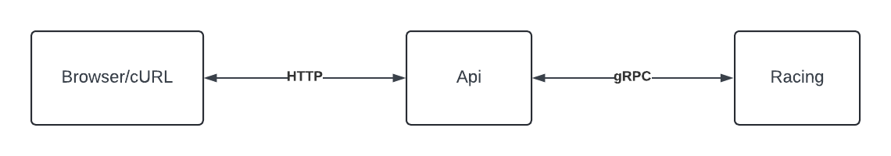

## Entain Backend C# .NET Technical Test

This test has been designed to demonstrate your ability and understanding of technologies commonly used at Entain. 

Please treat the services provided as if they would live in a real-world environment.

### Directory Structure

`Api`: A basic web API project, forwarding requests onto service(s).  
`Racing`: A very bare-bones racing service backed by SQLite db.
```
├── Entain-BE-DotNet-Technical-Test.sln
├── README.md
├── Api
│   ├── Api.csproj
│   ├── Api.http
│   ├── Program.cs
│   ├── Properties
│   │   └── launchSettings.json
│   ├── Protos
│   │   └── racing.proto
│   ├── Race.cs
│   ├── appsettings.Development.json
│   └── appsettings.json
└── Racing
    ├── Db
    │   └── racing.db
    ├── Models
    │   ├── Race.cs
    │   └── RacingContext.cs
    ├── Program.cs
    ├── Properties
    │   └── launchSettings.json
    ├── Protos
    │   └── racing.proto
    ├── Racing.csproj
    ├── Services
    │   └── RacingService.cs
    ├── appsettings.Development.json
    └── appsettings.json
```

### Getting Started

1. Install dotnet cli  
  
Mac:
```
# install brew https://brew.sh/
brew install asdf
# ...follow output instructions to add asdf to shell

asdf plugin add dotnet
asdf install dotnet 8.0.201
asdf global dotnet 8.0.201
```
  
Windows:  
https://learn.microsoft.com/en-us/dotnet/core/install/windows?tabs=net80
  
 
2. Start Racing and Api services
```
dotnet run --project Racing
dotnet run --project Api
```
  
3. Make Api request for races 
```
curl -X "POST" "http://localhost:5272/list-races" \
     -H 'Content-Type: application/json'
```  



##### Optional:  
If you want/need to change the DB schema, you'll need to update the scaffolded DB Model class files in Racing project (Racing/Models/). Therefore you'll need to install Entity Framework Core tools:  
https://learn.microsoft.com/en-us/ef/core/cli/dotnet  
```
dotnet tool install --global dotnet-ef
```

### Generating Proto Files

For example, in the Racing project, edit proto file `Racing/Protos/racing.proto` then when running a `dotnet build` or `dotnet run --project Racing` the auto-generated files output to:
```
Racing/obj/Debug/[TARGET_FRAMEWORK]/Protos
```

### Generating DB Model Files
```
cd Racing
dotnet ef dbcontext scaffold "Data Source=Db/racing.db" Microsoft.EntityFrameworkCore.Sqlite -o Models --force
```

### Changes/Updates Required

- We'd like to see you push this repository up to **GitHub/Gitlab/Bitbucket** and lodge a **Pull/Merge Request for each** of the below tasks.
- This means, we'd end up with **5x PR's** in total. **Each PR should target the previous**, so they build on one-another.
- Alternatively you can merge each PR/MR after each other into master.
- This will allow us to review your changes as well as we possibly can.
- As your code will be reviewed by multiple people, it's preferred if the repository is **publicly accessible**. 
- If making the repository public is not possible; you may choose to create a separate account or ask us for multiple email addresses which you can then add as viewers. 

... and now to the test! Please complete the following tasks.

1. Replace placeholder code in `Api/Program.cs` with races returned from Racing gRPC service.

2. Limit count of race items returned, max. 20. 

3. Add paging of items.

4. Add a filter to the existing RPC, so we can call `ListRaces` asking for races that are visible only.
   > We'd like to continue to be able to fetch all races regardless of their visibility, so try naming your filter as logically as possible. https://cloud.google.com/apis/design/standard_methods#list
5. We'd like to see the races returned, ordered by their `advertised_start_time`
   > Bonus points if you allow the consumer to specify an ORDER/SORT-BY they might be after. 
6. Our races require a new `status` field that is derived based on their `advertised_start_time`'s. The status is simply, `OPEN` or `CLOSED`. All races that have an `advertised_start_time` in the past should reflect `CLOSED`. 
   > There's a number of ways this could be implemented. Just have a go!
7. Introduce a new RPC, that allows us to fetch a single race by its ID.
   > This link here might help you on your way: https://cloud.google.com/apis/design/standard_methods#get

**Don't forget:**

> Document and comment! Please make sure your work is appropriately documented/commented, so fellow developers know whats going on.


### Good Reading

- [Protocol Buffers](https://developers.google.com/protocol-buffers)
- [Google API Design](https://cloud.google.com/apis/design)
